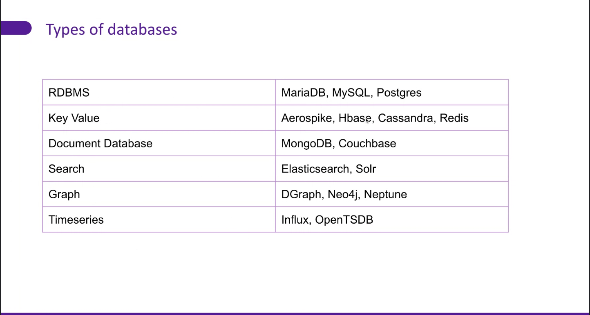
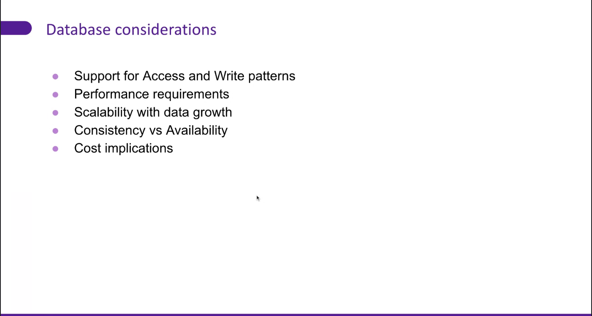
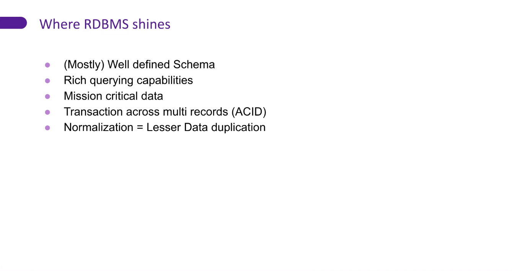
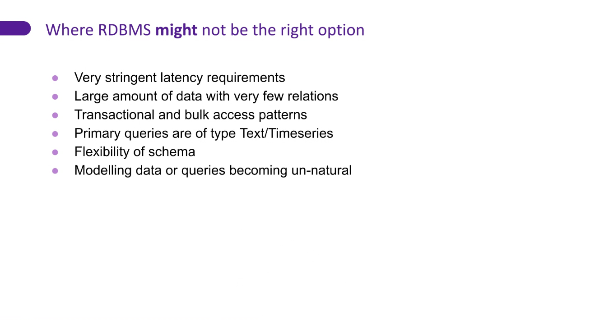

# DB Modelling 

## 1. DataBases Choices 

### What is Sharding? 
In DBMS, Sharding is a type of DataBase partitioning in which a large DataBase is divided or partitioned into smaller data and different nodes

### Features of Sharding:

 > Sharding makes the Database smaller \
 > Sharding makes the Database faster \
 > Sharding makes the Database much more easily manageable \
 > Sharding can be a complex operation sometimes \
 > Sharding reduces the transaction cost of the Database \
 > Each shard reads and writes its own data. \
 > Many NoSQL databases offer auto-sharding. \
 > Failure of one shard doesn’t affect the data processing of other shards. \

> Don't use RDBMS when data is scattered 

### What is DataBase Normalisation ?
Normalization is the process of organizing data in a database. Normalization is a database design technique that reduces data redundancy and eliminates undesirable characteristics like Insertion, Update and Deletion Anomalies. Normalization rules divides larger tables into smaller tables and links them using relationships. The purpose of Normalisation in SQL is to eliminate redundant (repetitive) data and ensure data is stored logically

#### Database Normal Forms

Here is a list of Normal Forms in SQL:

1. 1NF (First Normal Form)
2. 2NF (Second Normal Form)
3. 3NF (Third Normal Form)
4. BCNF (Boyce-Codd Normal Form)
5. 4NF (Fourth Normal Form)
6. 5NF (Fifth Normal Form)
7. 6NF (Sixth Normal Form)
