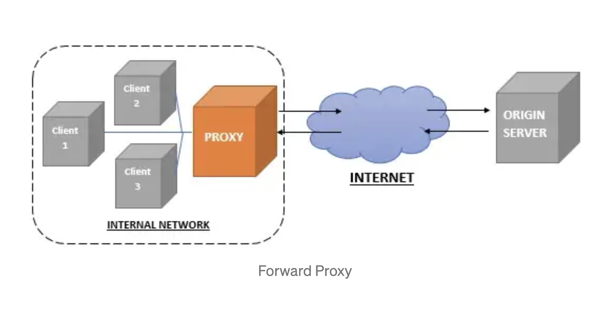
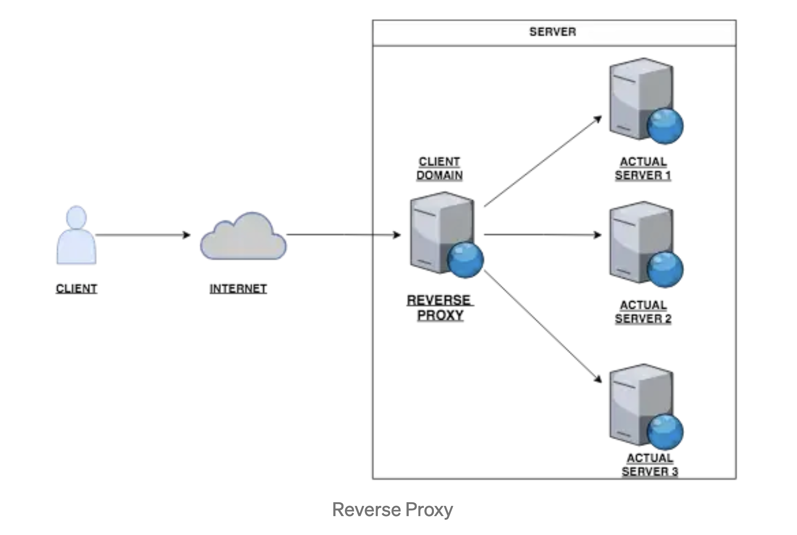

## Proxy 

A proxy is a simple server between you and your intended host on the internet.

it works by intercepting connections between sender and receiver. All incoming data enters through one port and is forwarded to the rest of the network via another port.

two types of proxy :
- forward proxy :- They are usually placed by the clients or the internal network from the client side. There can be various use cases for using a forward proxy like keeping track of requests, responses, deny access to some domains, modifying the headers, changing the location etc.

- reverse proxy :- These type of proxies are employed by the servers, mostly for security and load balancing purposes. Clients hit these reverse proxy servers instead of the actual servers, then these proxy serves the request to the actual server. For a web server, there are several benefits associated with such architecture. It can keep malicious users out, load balance between the servers and can reduce the load on its origin servers by caching static content.

## SOCKS : Socket Secure

it is a network protocol that facilitates communication with servers through a firewall by routing network traffic to the actual server on behalf of a client. SOCKS is designed to route any type of traffic generated by any protocol or program.